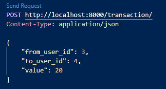

# Инструкция по запуску
Для подготовки проекта к запуску необходимо подключить свою базу данных PostgreSQL в настройках 
Django (для этого вместо данных *your name* и т.д. введите свои). Затем примените миграции 
и загрузите фикстуры.
Запуск проекта производится командой *python manage.py runserver*

# Примеры запросов
### Создание пользователя:

### Получение данных о балансе:

### Пополнение и списание с баланса:

### Транзакция между пользователями:

